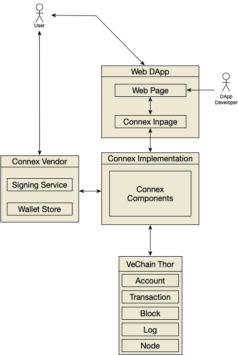

# Connex [](https://gitter.im/vechain/thor?utm_source=badge&utm_medium=badge&utm_campaign=pr-badge)

[](https://badge.fury.io/js/%40vechain%2Fconnex)

## Introduction

Connex is the standard interface to connect DApp with VeChain and user. `Connex` is a set of well-designed APIs for developers, with injected `Connex Object` in web applications they can  easily build decentralized applications.

## Get Started 

[Sync](https://github.com/vechain/thor-sync.electron/releases) or other compatible client will expose `connex` API by an injected object on `Window Object`.

### TypeScript(Recommended)

``` bash
npm install @vechain/connex --save-dev
```

Add `@vechain/connex` to `compilerOptions.types`  in `tsconfig.json` then you are good to go!

### Vanilla JS

No need to setup, just code in your favorite way.

## Usage

``` javascript
const el = document.createElement('h1')
if(window.connex){
    const status = connex.thor.status
    el.innerText = 'You are \'connexed\' to vechain, the status is ' + (status.progress === 1 ? 'synced': 'syncing')
}else{
    el.innerText = ':( seems you don\'t have enough component to launch this app, please ......'
}
document.querySelector('body').append(el)
```

## Developers

+ [API Reference]() for dApp developers
+ [Implementation Guideline]() for developer who is interested in implementing `connex` in other client(eg. mobile, browser extension), please take a look atwe provided that should be followed by any clients for `connex` that can ensure all users can have same user experience when interacting with DApps on VeChain.

## Architecture explained



## Compatible clients

+ [VeChain Sync](https://github.com/vechain/thor-sync.electron)

## License

Connex is licensed under the
[GNU Lesser General Public License v3.0](https://www.gnu.org/licenses/lgpl-3.0.html), also included
in *LICENSE* file in repository.