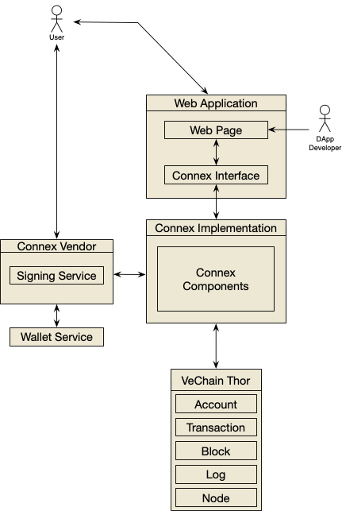

# Connex

[](https://badge.fury.io/js/%40vechain%2Fconnex)
&nbsp;&nbsp; [](https://t.me/VeChainDevCommunity)

[Connex Powered VeChain Wallets](https://env.vechain.org/)

[API Reference](https://docs.vechain.org/connex/)

## Introduction

Connex is the standard interface to connect VeChain apps with VeChain blockchain and user. `Connex` is a set of well-designed APIs for developers, with injected `Connex Object` in web applications they can easily build decentralized applications.


## Get Started 

[Sync](https://env.vechain.org/#sync) or other compatible clients will expose `connex` API by an injected object on `Window Object`.

### VeChain App Bootstrapping

VeChain apps are usually web apps. On app load, you always need to detect Connex component. If Connex is not available, you may instruct people to setup Connex environment.

To simplify these steps, simply perform redirection:

```javascript
if(!window.connex) {
    location.href = 'https://env.vechain.org/r/#' + encodeURIComponent(location.href)
}
```

Additionally, network can be specified:

```javascript
if(!window.connex) {
    // the app prefers running on test net
    location.href = 'https://env.vechain.org/r/#/test/' + encodeURIComponent(location.href)
}
```

### Install

#### TypeScript(Recommended)

``` bash
npm install @vechain/connex --save-dev
```

Place following line in any .ts file of your project
```typescript
import '@vechain/connex'
```
or

add `@vechain/connex` to `compilerOptions.types`  in `tsconfig.json` then you are good to go!

#### Vanilla JS

No need to set up, just code in your favourite way.

### Usage

``` javascript
const el = document.createElement('h1')

const status = connex.thor.status
el.innerText = 'You are \'connexed\' to vechain, the status is ' + (status.progress === 1 ? 'synced': 'syncing')

document.querySelector('body').append(el)
```

## Resource

+ [Connex Implementation Test](https://connex-impl-test.vecha.in)

## Architecture explained




## FAQ

#### TypeScript complier does not find Connex

First, check `tsconfig.json` and make sure  `@vechain/connex` is present in `compilerOptions.types`. Furthermore if you are doing an angular project and still get the error, you are probably using a larger project with multiple project roots, just adding `@vechain/connex` to the root config is not enough in this case. You also have to find all `tsconfig.app.ts` and `tsconfig.spec.ts` files in your sub-projects. While these inherit from the main `tsconfig.json` you have to make sure it does not override the types with for example `"types": []` and that there is no conflict with `typesRoots`

## License

Connex is licensed under the
[GNU Lesser General Public License v3.0](https://www.gnu.org/licenses/lgpl-3.0.html), also included
in *LICENSE* file in the repository.
